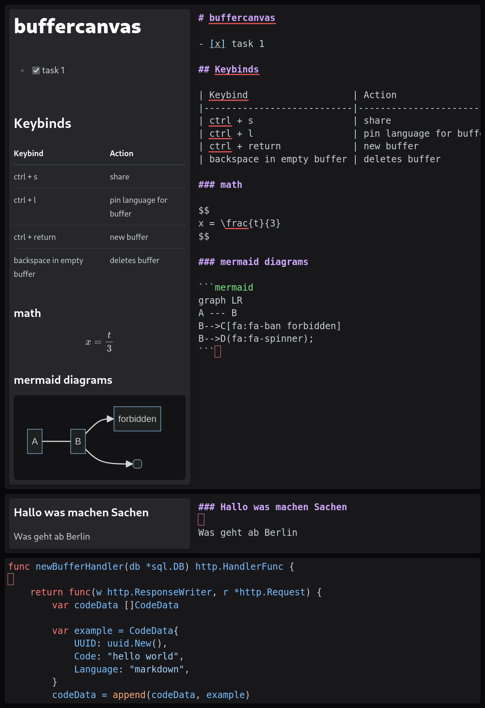
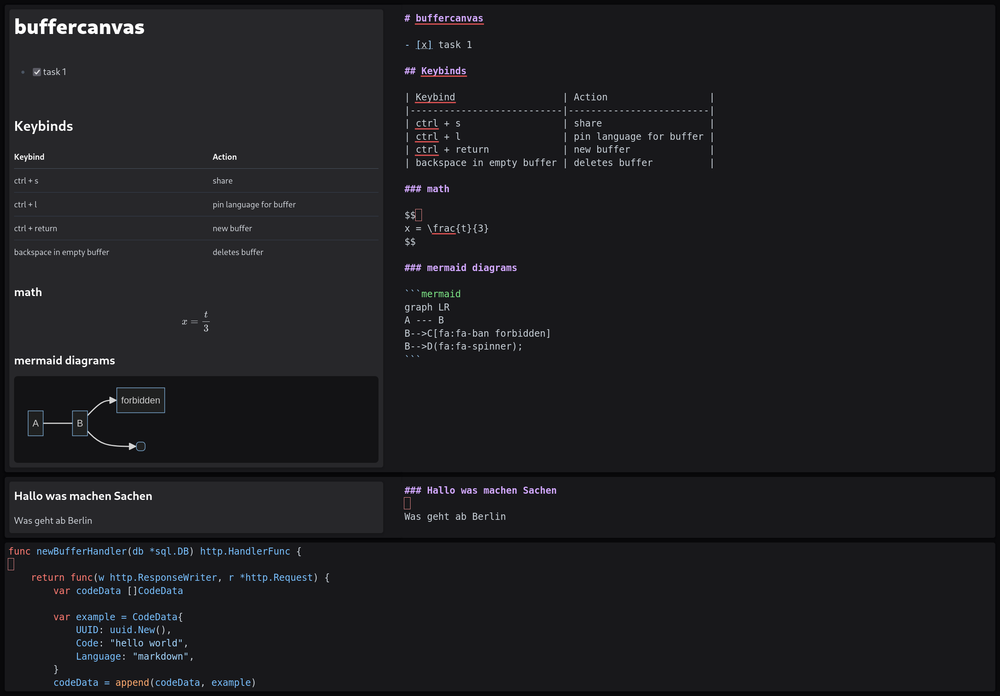

# Buffer Canvas

This project is very much work in progress!

Live Demo: https://canvas.nilsherzig.com (read keybinds below)

(name is subject to change)

Basically https://github.com/heyman/heynote/ but as a (self-hostable) website.

I really like `heynote`, but I dislike desktop programs. This is going to be my attempt to implement something like `heynote` as a website, 
Which would allow easy mobile access and build in sync / share capabilities.

### Keybinds 

| Keybind                   | Action                  |
|---------------------------|-------------------------|
| ctrl + s                  | share                   |
| ctrl + l                  | pin language for buffer |
| ctrl + return             | new buffer              |
| backspace in empty buffer | deletes buffer          |
